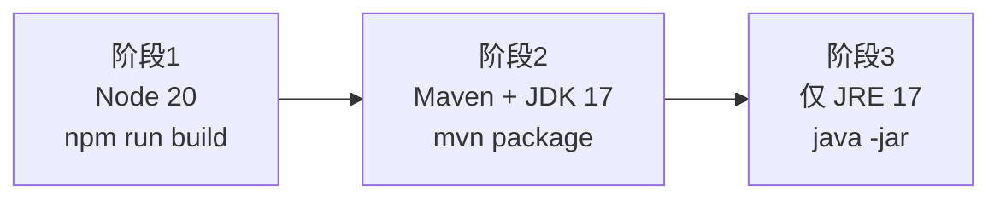

# Railway 部署指南（Smart Manager）

本文说明如何将本仓库中的 **智慧管理平台** 部署到 [Railway](https://railway.com/)：包含 **MySQL**、**Spring Boot 3 后端**（`smart-manager-backend`）以及可选的 **Vue 3 前端**（`smart-manager`）。

> **适用对象**：已有 GitHub/GitLab 仓库、熟悉基础命令行与环境变量的开发者。  
> **技术栈**：JDK 17、Maven、MySQL 8、Node.js 20+（仅前端构建需要）。

---

## 目录

1. [架构与部署模式](#1-架构与部署模式)
2. [Railway 账号与项目准备](#2-railway-账号与项目准备)
3. [部署前建议修改（端口与配置）](#3-部署前建议修改端口与配置)
4. [创建 MySQL 服务](#4-创建-mysql-服务)
5. [部署后端 Java 服务](#5-部署后端-java-服务)
6. [初始化数据库](#6-初始化数据库)
7. [部署前端（两种方案）](#7-部署前端两种方案)
8. [Dockerfile 一键镜像部署（新手向）](#8-dockerfile-一键镜像部署新手向)
9. [环境变量一览](#9-环境变量一览)
10. [自定义域名与 HTTPS](#10-自定义域名与-https)
11. [费用与资源说明](#11-费用与资源说明)
12. [常见问题与排查](#12-常见问题与排查)
13. [附录：单仓库多服务目录说明](#13-附录单仓库多服务目录说明)

---

## 1. 架构与部署模式

### 1.1 推荐组合

| 组件 | Railway 中的形态 | 说明 |
|------|------------------|------|
| 数据库 | **MySQL** 模板服务 | 官方文档：[MySQL on Railway](https://docs.railway.com/guides/mysql) |
| 后端 | **GitHub 仓库** 部署的 Web Service | 二选一：① Nixpacks + 根目录 `smart-manager-backend`；② **根目录 Dockerfile**（见 [第 8 节](#8-dockerfile-一键镜像部署新手向)） |
| 前端 | 见下文 [两种方案](#7-部署前端两种方案) | 使用 Dockerfile 时，前端在镜像构建阶段自动打进后端 `static`，**天然同域** |

### 1.2 网络与端口

- Railway 为 **Web 服务**注入 **`PORT`** 环境变量（动态端口），应用必须监听该端口。
- 当前仓库 `application.yml` 中写死 `server.port: 8081`，**在 Railway 上必须改为使用 `PORT`**（见 [第 3 节](#3-部署前建议修改端口与配置)）。

### 1.3 仓库结构（单 Repo 多服务）

```
datacenter2/
├── Dockerfile               # 可选：根目录一键构建镜像（前端 + 后端）
├── .dockerignore            # 减小上传体积、加快构建
├── smart-manager/           # Vue 3 + Vite 前端
├── smart-manager-backend/   # Spring Boot 后端
└── docs/
    └── RAILWAY_DEPLOY.md    # 本文档
```

每个 Railway Service 可指向同一仓库的 **不同 Root Directory**。

---

## 2. Railway 账号与项目准备

1. 打开 [railway.com](https://railway.com/)，使用 GitHub 登录。
2. **New Project** → **Deploy from GitHub repo**，选择本仓库。
3. 建议为「数据库」「后端」「前端」分别建立 **独立 Service**，便于扩缩容与查看日志。

> 若仓库为私有，需在 GitHub 中授权 Railway 应用访问该仓库。

---

## 3. 部署前建议修改（端口与配置）

### 3.1 监听 Railway 的 `PORT`（必做）

本仓库已在 `application.yml` 中配置为 **`port: ${PORT:8081}`**：Railway 注入的 `PORT` 会生效；本地未设置 `PORT` 时仍为 **8081**。

若你使用旧分支或未合并该配置，也可在 **Start Command** 中传参：

```bash
java -jar target/smart-manager-backend-0.0.1-SNAPSHOT.jar --server.port=$PORT
```

### 3.2 生产环境敏感配置

以下项务必通过 Railway **Variables** 注入，**不要**把真实密码写进 Git：

| 配置项（YAML 路径） | 环境变量名（Spring Boot  relaxed binding） | 说明 |
|---------------------|--------------------------------------------|------|
| `spring.datasource.url` | `SPRING_DATASOURCE_URL` | JDBC 连接串 |
| `spring.datasource.username` | `SPRING_DATASOURCE_USERNAME` | 数据库用户 |
| `spring.datasource.password` | `SPRING_DATASOURCE_PASSWORD` | 数据库密码 |
| `jwt.secret` | `JWT_SECRET` | JWT 签名密钥，**必须足够长且随机** |

---

## 4. 创建 MySQL 服务

1. 在项目画布中 **New** → **Database** → **MySQL**（或通过 `Ctrl/Cmd + K` 搜索 MySQL）。
2. 等待 MySQL 部署完成。Railway 会在该服务上提供变量（官方说明）：
   - `MYSQLHOST`
   - `MYSQLPORT`
   - `MYSQLUSER`
   - `MYSQLPASSWORD`
   - `MYSQLDATABASE`
   - `MYSQL_URL`（通常为 `mysql://` 形式，**Spring 不能直接使用**，仍需 JDBC 形式）

3. **持久化**：MySQL 容器数据建议挂载 Volume，并在 Railway 文档中了解 [Backups](https://docs.railway.com/volumes/backups) 与数据恢复策略。

### 4.1 数据库名与 `init.sql`

本仓库 `smart-manager-backend/sql/init.sql` 会创建库 **`smart_manager_db`**。你有两种做法（二选一）：

**做法 A（与本地一致）**  
- 在 MySQL 服务上设置 `MYSQL_DATABASE`（或模板提供的等价变量）为 **`smart_manager_db`**（若模板支持自定义）。  
- 执行 `init.sql` 后，应用 JDBC 的库名使用 **`smart_manager_db`**。

**做法 B（使用 Railway 默认库名）**  
- 保持模板默认库名（例如部分模板为 `railway`）。  
- 修改 `init.sql` 中的库名，或仅导入表结构到当前库，并让 `SPRING_DATASOURCE_URL` 指向该库。

**原则**：`SPRING_DATASOURCE_URL` 里的库名与 **实际存在表结构的库** 一致。

---

## 5. 部署后端 Java 服务

### 5.1 新建 Web Service

1. **New** → **GitHub Repo** → 选同一仓库（若已连接可 **Empty Service** 再绑 Repo）。
2. 打开该 Service → **Settings**：
   - **Root Directory**：`smart-manager-backend`
   - **Branch**：`main`（或你的默认分支）

### 5.2 构建与启动（Nixpacks 自动检测）

Railway 对 Maven 项目通常会：

- 使用 **JDK 17**（与 `pom.xml` 中 `<java.version>17</java.version>` 一致）
- 执行 `mvn package` 或等价构建
- 需指定启动命令时，在 **Deploy** → **Custom Start Command** 填写：

```bash
java -jar target/smart-manager-backend-0.0.1-SNAPSHOT.jar
```

> JAR 文件名与 `pom.xml` 中 `<artifactId>`、`<version>` 一致：`smart-manager-backend-0.0.1-SNAPSHOT.jar`。

若构建未识别，可在 **Build** 区设置 **Custom Build Command**：

```bash
mvn -B -DskipTests package
```

### 5.3 将后端与 MySQL 连接（变量引用）

在后端 Service 的 **Variables** 中：

1. 点击 **Add Variable** → **Reference**（引用其它服务变量）。
2. 选择 MySQL 服务，逐个引用 `MYSQLHOST`、`MYSQLPORT`、`MYSQLUSER`、`MYSQLPASSWORD`、`MYSQLDATABASE`（便于核对）。
3. 新增 **合成变量** `SPRING_DATASOURCE_URL`（**把 `MySQL` 换成你在画布上 MySQL 服务的实际名称**）：

```text
jdbc:mysql://${{MySQL.MYSQLHOST}}:${{MySQL.MYSQLPORT}}/${{MySQL.MYSQLDATABASE}}?useUnicode=true&characterEncoding=utf-8&serverTimezone=Asia/Shanghai&allowPublicKeyRetrieval=true&useSSL=false
```

4. 设置：

```text
SPRING_DATASOURCE_USERNAME=${{MySQL.MYSQLUSER}}
SPRING_DATASOURCE_PASSWORD=${{MySQL.MYSQLPASSWORD}}
```

5. 设置强随机 **`JWT_SECRET`**（建议 64+ 字符；需与 HS512 等算法要求匹配你项目中的实现）。

6. 可选：关闭 SQL 调试日志以减少日志量：

```text
LOGGING_LEVEL_COM_SMART_MANAGER=INFO
```

### 5.4 生成公网 URL

在后端 Service → **Settings** → **Networking** 中 **Generate Domain**。  
记下形如 `https://your-backend.up.railway.app` 的地址，供前端或联调使用。

---

## 6. 初始化数据库

首次部署 **必须** 在 Railway 的 MySQL 中执行 `smart-manager-backend/sql/init.sql`（及你需要的其它 `sql/*.sql`），否则应用启动后会因缺表失败。

### 6.1 方式一：本机通过 TCP Proxy 导入（常用）

1. 在 MySQL Service 上启用 **TCP Proxy**（Railway 默认可能已提供连接信息，以控制台为准）。
2. 本机使用 MySQL 客户端连接（主机、端口、用户、密码见 Railway 面板或 Variables）。
3. 执行：

```bash
mysql -h <HOST> -P <PORT> -u <USER> -p < smart-manager-backend/sql/init.sql
```

### 6.2 方式二：Railway CLI / 临时 Job

使用 [Railway CLI](https://docs.railway.com/guides/cli) 在带 MySQL 客户端的镜像中执行 `mysql ... < init.sql`，或将 `init.sql` 放入一次性迁移容器。具体命令随 CLI 版本变化，以官方文档为准。

### 6.3 默认管理员账号

`init.sql` 中示例管理员（与后端 README 一致）：

- 用户名：`admin`
- 密码：`password`

**生产环境请立即修改密码**并妥善保管。

---

## 7. 部署前端（两种方案）

### 方案 A（推荐）：前后端同域 — 仅部署后端，静态资源由 Spring 提供

本仓库后端已配置将 `classpath:/static/` 作为静态资源，且 SPA 回退到 `index.html`（见 `WebMvcConfig`）。可将前端 **构建产物** 放入后端 `src/main/resources/static/` 后再打包。

**概要流程**（可在 CI 或本地提交前执行一次）：

```bash
cd smart-manager
npm ci
# 生产环境 API：与后端同域时使用相对路径 /api
export VITE_APP_BASE_API=/api
npm run build
# 将 dist 内文件复制到后端 static（注意清空旧文件）
rm -rf ../smart-manager-backend/src/main/resources/static/*
cp -r dist/* ../smart-manager-backend/src/main/resources/static/
cd ../smart-manager-backend
mvn -B -DskipTests package
```

然后在 Railway **仅部署后端一个 Web Service**，用户访问 **同一个域名** 即可打开页面并请求 `/api/**`，**无需 CORS**。

> **更省事**：仓库根目录的 `Dockerfile` 会在构建镜像时自动执行 `npm run build` 并把 `dist` 拷进后端 `static/`，无需你手工执行上面的 shell（见 [第 8 节](#8-dockerfile-一键镜像部署新手向)）。

> 若你希望前端构建仍指向「单独的后端域名」，可设置 `VITE_APP_BASE_API=https://你的后端域名/api`，但同域方案下用 `/api` 更简单。

### 方案 B：前后端分离 — 两个 Railway Service

1. 新建 Web Service，**Root Directory**：`smart-manager`。
2. **Build Command**：

```bash
npm ci && npm run build
```

3. 使用 **Static Hosting** 或 Nginx 镜像提供 `dist` 目录（以 Railway 当前支持的静态站点方式为准）。
4. **构建期环境变量**（Vite 在 build 时注入）：

```text
VITE_APP_BASE_API=https://your-backend.up.railway.app/api
```

5. **跨域**：当前后端 **未配置全局 CORS**。前后端不同源时，浏览器会拦截跨域请求。你需要在后端增加 CORS 配置（例如 `SecurityConfig` 中 `http.cors(...)` 或 `CorsConfigurationSource` Bean），将前端域名加入 `allowedOrigins`。  
   **若不想改后端代码，请优先采用方案 A。**

---

## 8. Dockerfile 一键镜像部署（新手向）

### 8.1 Dockerfile 是什么？一句话理解

**Dockerfile** 是一份「菜谱」：告诉计算机如何从 **零** 装环境、编译代码、最后只保留运行所需文件，打成一个 **镜像（image）**。  
**容器** 则是根据这份镜像跑起来的进程——在 Railway 上，每个 Web Service 本质上就是在跑这样一个容器。

本仓库根目录的 **`Dockerfile`** 采用 **多阶段构建**（三个阶段），你只需要把代码推上 GitHub，让 Railway **用 Dockerfile 构建**，不必在本地会 Maven / 会手动拷前端文件也能部署。

### 8.2 本仓库镜像里三个阶段分别做什么？



| 阶段 | 基础镜像 | 做什么 | 是否进入最终镜像 |
|------|----------|--------|------------------|
| 1 | `node:20-bookworm-slim` | 安装前端依赖、`npm run build`，得到 `dist/` | 否（用完即丢） |
| 2 | `maven:3.9-eclipse-temurin-17` | 拷贝后端源码，把阶段 1 的 `dist/` 放到 `src/main/resources/static/`，执行 `mvn package` | 否 |
| 3 | `eclipse-temurin:17-jre-jammy` | 只拷贝打好的 `smart-manager-backend-0.0.1-SNAPSHOT.jar`，用 `java -jar` 启动 | **是（上线只有这一层）** |

优点：**最终镜像里没有 Node、没有 Maven**，体积小、攻击面小；前后端 **同域**，避免 CORS。

### 8.3 本地如何试构建（可选，帮助理解）

在仓库根目录执行（需已安装 [Docker Desktop](https://www.docker.com/products/docker-desktop/) 并启动）：

```bash
cd /path/to/datacenter2
docker build -t smart-manager:local .
```

构建成功后，仅用于冒烟时可在本机起一个容器（**下面 URL 需换成你本机 MySQL**，且先导入 `init.sql`）：

```bash
docker run --rm -p 8081:8081 ^
  -e PORT=8081 ^
  -e SPRING_DATASOURCE_URL="jdbc:mysql://host.docker.internal:3306/smart_manager_db?useUnicode=true&characterEncoding=utf-8&serverTimezone=Asia/Shanghai&allowPublicKeyRetrieval=true&useSSL=false" ^
  -e SPRING_DATASOURCE_USERNAME=root ^
  -e SPRING_DATASOURCE_PASSWORD=你的密码 ^
  -e JWT_SECRET=请使用与生产类似的长随机串 ^
  smart-manager:local
```

Windows PowerShell 可把 `^` 换成 **行末反引号 `` ` ``**，或写成一行。浏览器访问 `http://localhost:8081/`。

### 8.4 在 Railway 上使用 Dockerfile（操作清单）

1. 与 [第 4 节](#4-创建-mysql-服务) 一样，先建好 **MySQL**。
2. **New** → **GitHub Repo** → 选本仓库，新建一个 **Web Service**（若已有 Nixpacks 后端服务，可删掉或改为本流程，**不要两个服务抢同一域名**）。
3. 打开该 Service → **Settings**：
   - **Root Directory**：留空，或填 **`/`**（必须是 **仓库根目录**，这样构建上下文包含 `smart-manager` 与 `smart-manager-backend`）。
   - **Builder**：选择 **Dockerfile**（若 Railway 同时检测到 Nixpacks 与 Dockerfile，以界面为准，**显式选 Dockerfile**）。
   - **Dockerfile Path**：`Dockerfile`（默认即可）。
4. 在 **Variables** 中按 [第 9.1 节](#91-后端web-service) 配置 `SPRING_DATASOURCE_*`、`JWT_SECRET`（与 Nixpacks 方式相同，变量名不变）。
5. **Deploy**。首次构建会较慢（拉 Maven 依赖、npm ci）；成功后 **Generate Domain**，浏览器打开根路径即可访问前端，接口路径仍为 `/api/**`。

### 8.5 `.dockerignore` 是干什么的？

根目录 **`.dockerignore`** 列出 **不要上传** 到构建上下文的文件（例如本机 `node_modules`、`target`）。  
这样 `docker build` 和 Railway 上传上下文都 **更快、更省流量**。

### 8.6 改 JAR 名或版本后要注意什么？

`Dockerfile` 最后一阶段写死了 JAR 路径：

`target/smart-manager-backend-0.0.1-SNAPSHOT.jar`

若你修改了 `pom.xml` 里的 `<artifactId>` / `<version>`，请同步修改 `Dockerfile` 中该文件名。

### 8.7 与「只用 Nixpacks」相比怎么选？

| 方式 | 适合谁 | 说明 |
|------|--------|------|
| **Dockerfile（本仓库）** | 希望「推代码即部署」、不想本地拼静态资源 | 前后端一次构建，环境可复现 |
| **Nixpacks + Root `smart-manager-backend`** | 不想维护 Docker、只要后端 API | 需另部署前端或手工拷 `dist` |

---

## 9. 环境变量一览

### 9.1 后端（Web Service）

| 变量名 | 是否必填 | 说明 |
|--------|----------|------|
| `PORT` | Railway 自动注入 | 应用监听端口 |
| `SPRING_DATASOURCE_URL` | 是 | JDBC URL，建议引用 MySQL 变量拼接 |
| `SPRING_DATASOURCE_USERNAME` | 是 | 可与 `MYSQLUSER` 引用一致 |
| `SPRING_DATASOURCE_PASSWORD` | 是 | 可与 `MYSQLPASSWORD` 引用一致 |
| `JWT_SECRET` | 强烈建议 | 覆盖默认 YAML 中的 JWT 密钥 |
| `SPRING_PROFILES_ACTIVE` | 可选 | 若你增加 `application-prod.yml` 可设为 `prod` |

### 9.2 前端构建（仅方案 B）

| 变量名 | 说明 |
|--------|------|
| `VITE_APP_BASE_API` |  axios `baseURL`，指向后端 `/api` 根路径，例如 `https://xxx.up.railway.app/api` |

---

## 10. 自定义域名与 HTTPS

1. 在后端（或静态站点）Service → **Settings** → **Networking** → **Custom Domain**。
2. 按提示在你的 DNS 提供商处添加 **CNAME** 记录。
3. Railway 会自动提供 **HTTPS** 证书（以平台当前能力为准）。

若使用「方案 A」单服务或 **Dockerfile 全栈单容器**，只需为该 **Web Service** 绑定域名即可。

---

## 11. 费用与资源说明

- Railway 按 **订阅套餐 + 资源用量** 计费，详见官方 [Pricing](https://docs.railway.com/pricing/plans)。
- **MySQL 外连 TCP Proxy** 可能产生 **出站流量费用**，见 [Network Egress](https://docs.railway.com/pricing/plans#resource-usage-pricing)。
- 建议开启用量告警，并为生产库配置备份与恢复演练。

---

## 12. 常见问题与排查

### 12.1 启动失败：`Web server failed to start. Port ... was already in use`

未使用 Railway 的 `PORT`。请确认 `application.yml` 中为 `port: ${PORT:8081}`，见 [第 3.1 节](#31-监听-railway-的-port必做)。

### 12.2 数据库连接失败

- 检查 `SPRING_DATASOURCE_URL` 是否含正确库名、时区、**`allowPublicKeyRetrieval=true`**（MySQL 8 常见）。
- 确认后端与 MySQL 在 **同一 Railway Project** 内，引用变量名与服务名一致（`${{服务名.变量名}}`）。

### 12.3 表不存在 / 404 / 500

多为 **未执行 `init.sql`**。重新导入并查看部署日志中的 SQL 异常。

### 12.4 前端能打开但接口报 CORS 错误

属于 **跨域**：请使用 [方案 A](#方案-a推荐前后端同域--仅部署后端静态资源由-spring-提供) 或 [第 8 节 Dockerfile 部署](#8-dockerfile-一键镜像部署新手向)；分域部署请按 [方案 B](#方案-b前后端分离--两个-railway-service) 增加后端 CORS。

### 12.5 构建 OOM 或过慢

在 Service **Settings** 中提高实例资源；使用 Dockerfile 时首次构建会下载较多依赖，后续有缓存会快一些。也可在本地 `docker build` 确认是否因内存不足失败。

---

## 13. 附录：单仓库多服务目录说明

| Railway Service | Root Directory | 典型 Build | 典型 Start |
|-----------------|----------------|------------|------------|
| MySQL | （模板） | 无 | 无 |
| **全栈（Docker）** | **留空（仓库根）** | **`docker build`（见根目录 `Dockerfile`）** | **`java -jar app.jar`（镜像内已配置）** |
| Backend（Nixpacks） | `smart-manager-backend` | `mvn -B -DskipTests package` | `java -jar target/smart-manager-backend-0.0.1-SNAPSHOT.jar` |
| Frontend（可选） | `smart-manager` | `npm ci && npm run build` | 静态托管 `dist` |

---

## 文档维护

- 本文基于仓库内 `application.yml`、`pom.xml`、根目录 `Dockerfile` 及 Railway 公开文档整理；平台 UI 与变量名可能更新，**以 Railway 控制台与官方文档为准**。
- 若升级 Spring Boot / 更换数据库插件，请同步检查 JDBC 参数与变量引用语法；若修改 `pom.xml` 版本号，请同步 [第 8.6 节](#86-改-jar-名或版本后要注意什么)。

祝部署顺利。
